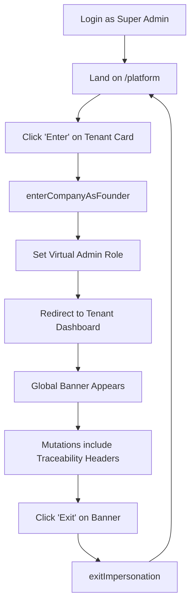

# IMPERSONATION IMPLEMENTATION (Visitor Admin)

**Role**: BETO (Platform Founder)
**Status**: Implementation Ongoing

## 1. Login Flow (Founder)
1. **Login**: User enters credentials at `/login`.
2. **Detection**: `AuthProvider` fetches user record and detects `is_super_admin: true`.
3. **Platform Mode**: Instead of selecting a company, the system sets `mode = 'platform'`.
4. **Redirection**: `App.tsx` identifies the Platform context and redirects to `/platform` (The Control Panel).

---

## 2. Activating Impersonation
1. **Selection**: Go to `/platform` and view the list of all tenants.
2. **Action**: Click **"Enter as Founder"** for a specific company (e.g., "Particulart").
3. **Transition**: 
   - `mode` flips to `'company'`.
   - `impersonatedCompanyId` is set to the target company.
   - The app navigates to `/dashboard`.
4. **Validation**: A **Global Banner** appears at the top: `MODO FUNDADOR — Inspeccionando: Particulart`.

---

## 3. Exiting Impersonation
1. **Action**: Click **"Exit"** on the Global Banner or sidebar footer link.
2. **Transition**: 
   - `mode` returns to `'platform'`.
   - `impersonatedCompanyId` is cleared.
   - `currentCompany` is set to `null`.
3. **Redirection**: User is returned to `/platform`.

---

## 4. Traceability & Safety
*   **Headers**: Every Edge Function call during impersonation carries `x-platform-actor-id`.
*   **Logging**: These headers are logged by the server-side logic to distinguish Platform actions from Member actions.
*   **No Contamination**: The `company_members` table is **NEVER** modified. The Founder remains a visitor.

---

## 5. Files Modified
- `AuthProvider.tsx`: Core state logic for platform vs company.
- `App.tsx`: Routing guards and Founder redirection.
- `Layout.tsx`: Sidebar integration.
- `PlatformAdmin.tsx`: Rebranded as Platform Home with impersonation actions.
- `supabase.ts`: Traceability header injection.
- [NEW] `ImpersonationBanner.tsx`: Visual feedback and exit control.

## 6. Technical Source of Truth
*   **Context Variable**: `currentCompanyId` is the single source of truth for the active company context.
    - In `AuthContext`, `currentCompany` is the object reference.
    - In `useStore` (Zustand), `currentCompanyId` is the ID string.
    - Both are kept in sync by `AuthProvider.tsx`.
*   **Impersonation State**: `isImpersonating` (Zustand) and `mode === 'company'` (AuthContext) identify if the actor is a Super Admin in Visitor mode.

## 7. Operational Flow

## 8. Anti-Contamination Verification
To ensure no data contamination occurs:
1.  **Zero Membership**: We verify that the user ID of the Super Admin **never** appears in the `company_members` table for the impersonated company.
2.  **Stateless DB Access**: RLS policies for Super Admins allow bypass or global access, but the application layer forces a `company_id` filter on all queries based on the "Visitor" context.
3.  **Traceability Auditing**: Every mutation performed while `x-impersonation-active` is `true` is tagged with the Founder's ID via headers, ensuring that if a record is created/updated (e.g., via Edge Functions), we know it was a "Visitor" action even though they aren't a member.
