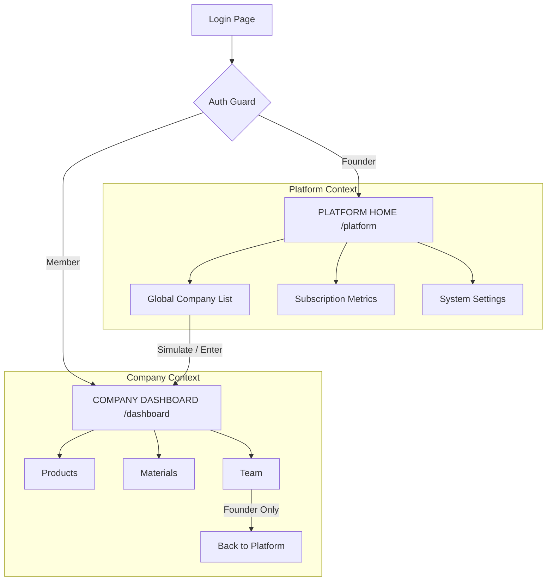

# CALCPRO SAAS EVOLUTION STRATEGY

**Goal**: Transform from "Multi-Tenant App" to "SaaS Platform" with minimal friction.

---

## 1. Login Flow Evolution: "Platform First" Landing

### Current Flow
- User Logs In → `AuthProvider` fetches user & memberships → `App.tsx` finds a company → Redirects to `/dashboard`.

### Proposed Evolution (Founder-Specific)
1.  **Identity Awareness**: The `AuthProvider` detects the `is_super_admin` bit.
2.  **Strategic Branching**: 
    - **Tenant User**: Lands in `/dashboard` (no change).
    - **Founder (BETO)**: Lands in `/platform` (the new **Platform Home**).
3.  **Entry Logic**: Instead of `App.tsx` forcing a company, it honors a "Platform Landing" if the user has platform privileges.

---

## 2. Introducing Platform Context (Non-Breaking)

We introduce a **Mode-Based Context** in the state:

- **SaaS Mode**: The UI shows Global Metrics, Company List, Plans, and System Logs. The Sidebar is blue/dark (Platform Branded).
- **Company Mode**: The UI focus is on Products, Materials, and Team for ONE specific tenant. The Sidebar reflects the Company branding.

**Key Change**: The platform identity (BETO) is the "Master Key" that *chooses* which mode to operate in, rather than being default-assigned to a company.

---

## 3. Minimal Architectural Changes

To maintain stability and avoid RLS/DB rewrites:

### A. State Enhancement (`AuthProvider.tsx`)
*   Add a `viewMode` property: `'platform' | 'tenant'`.
*   If `user.is_super_admin` is true, `viewMode` defaults to `'platform'`.
*   `currentCompanyId` becomes optional for Super Admins.

### B. Routing Guard (`App.tsx`)
*   Modify the "Provisioning Guard" to allow Super Admins to remain "Company-less" while in Platform Mode.
*   Update the root redirect (`/`):
    - If `isSuperAdmin` → `/platform`
    - Else → `/dashboard`

### C. Unified Layout (`Layout.tsx`)
*   Add a "Switch to Platform" button at the bottom of the sidebar (visible ONLY to Super Admins).
*   Add a "Switch to Company" action in the Platform Home company list.

---

## 4. Conceptual Structure: The Navigation Funnel

---

## 5. Summary of Real-World Impact

*   **For regular users**: Zero change. They see their dashboard as always.
*   **For BETO**: You finally land in your "Control Seat". You see the health of CALCPRO first.
*   **For the Code**: 
    - No database migrations.
    - No changes to RLS policies.
    - Minor logic additions to 3 existing files: `App.tsx`, `AuthProvider.tsx`, and `Layout.tsx`.
    - Evolution of `PlatformAdmin.tsx` into a proper Home page.
