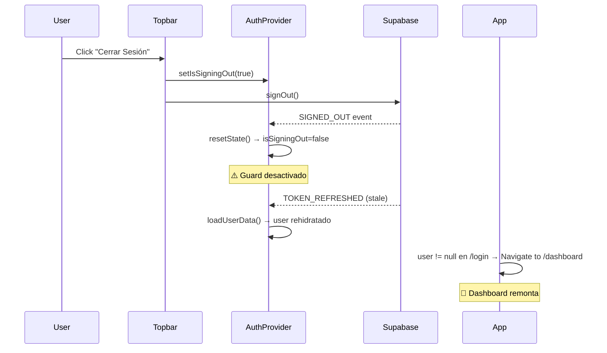

# Auditoría: Ciclo de Vida de Autenticación — BETO OS

> **Fecha**: 2026-02-21  
> **Alcance**: Solo archivos de autenticación (`AuthProvider.tsx`, `useAuth.ts`, `Topbar.tsx`, `App.tsx`)  
> **Síntoma reportado**: Tras cerrar sesión, la app redirige de vuelta al dashboard. El usuario permanece visualmente autenticado.

---

## 1. Resumen Ejecutivo

**Causa raíz**: Una condición de carrera entre `resetState()` y el flujo de `handleLogout`. Cuando el logout se ejecuta, `resetState()` (línea 68 de `AuthProvider.tsx`) borra prematuramente la bandera `isSigningOut`, desbloqueando la rehidratación de datos antes de que la navegación a `/login` se complete.

**Flujo del bug**:
```
1. Topbar.handleLogout → setIsSigningOut(true) ✅
2. supabase.auth.signOut() ejecuta ✅
3. resetState() llamado por Topbar → isSigningOut = false ❌ ← AQUÍ
4. onAuthStateChange emite TOKEN_REFRESHED o SIGNED_IN (stale token)
5. loadUserData() se ejecuta (guard desactivado porque isSigningOut = false)
6. user se re-hydrata → App detecta user != null → redirige a /dashboard
```

---

## 2. Análisis Archivo por Archivo

### 2.1 [AuthProvider.tsx](file:///c:/Users/Beto/Documents/APP/cost-margin-manager/src/hooks/AuthProvider.tsx) — El corazón del problema

#### Problema Crítico: `resetState` destruye su propia guardia

```typescript
// Línea 57-70
const resetState = useCallback(() => {
    console.log('[AuthProvider] resetState called');
    setUser(null);
    // ... limpia todo ...
    isSigningOutRef.current = false;  // ❌ PROBLEMA: Resetea el guard
    useStore.getState().logout();
    setIsLoading(false);
    setIsSigningOut(false);           // ❌ DOBLE PROBLEMA
}, []);
```

> [!CAUTION]
> **Línea 66**: `isSigningOutRef.current = false` elimina la protección contra rehidratación ANTES de que el flujo de logout complete la navegación. Esto permite que un `onAuthStateChange` diferido (ej: `TOKEN_REFRESHED`) pase el guard en línea 74 y vuelva a cargar los datos del usuario.

#### Problema Alto: Listener puede emitir eventos post-signOut

```typescript
// Línea 198-231
supabase.auth.onAuthStateChange(async (event, session) => {
    // Guard correcto:
    if (isSigningOutRef.current && event !== 'SIGNED_OUT') {
        return; // ✅ Funciona... mientras isSigningOutRef sea true
    }
    
    if (event === 'SIGNED_OUT') {
        resetState(); // ❌ Esto resetea isSigningOutRef → abre la puerta
        return;
    }
    
    // Si llega INITIAL_SESSION o TOKEN_REFRESHED DESPUÉS del resetState,
    // ya no hay guard que los bloquee
    if (event === 'SIGNED_IN' && session?.user) {
        await loadUserData(session.user.id); // ❌ Se ejecuta libremente
    }
});
```

**Secuencia real de eventos de Supabase Auth**:
1. `signOut()` → Supabase emite `SIGNED_OUT`
2. `resetState()` → `isSigningOutRef = false`  
3. El SDK de Supabase puede emitir un `INITIAL_SESSION` residual al detectar un token en localStorage que aún no ha expirado
4. `loadUserData()` se ejecuta → usuario rehidratado → dashboard remonta

#### Problema Medio: useEffect guardián sin acción real (Línea 238-242)

```typescript
useEffect(() => {
    if (!isLoading && user && window.location.pathname === '/login') {
        console.log('[AuthProvider] User detected on /login, triggering redirect');
        // ❌ Solo loguea, no redirige. Código muerto.
    }
}, [user, isLoading]);
```

---

### 2.2 [Topbar.tsx](file:///c:/Users/Beto/Documents/APP/cost-margin-manager/src/components/os/Topbar.tsx) — Flujo de Logout

```typescript
// Línea 25-48
const handleLogout = async () => {
    setIsSigningOut(true);           // ✅ Activa el guard

    try {
        await supabase.auth.signOut(); // ✅ Llama a Supabase
        logout();                      // ✅ Limpia Zustand
        resetState();                  // ❌ CAUSA RAÍZ: resetea el guard
    } catch (error) {
        resetState();
    } finally {
        navigate('/login', { replace: true }); // Navegación al final
    }
};
```

> [!WARNING]
> **El problema está en el orden de operaciones**: `resetState()` se llama ANTES de `navigate('/login')`. Entre estas dos instrucciones hay una ventana donde `isSigningOut` ya es `false` y cualquier re-render puede montar componentes que dependen de `user`.

---

### 2.3 [App.tsx](file:///c:/Users/Beto/Documents/APP/cost-margin-manager/src/App.tsx) — El Router

```typescript
// Línea 57-65 — Guard correcto pero insuficiente
if (isSigningOut) {
    return (<div>Signing out...</div>); // ✅ Bloquea routing
}

// Línea 79-81
if (!user) {
    return <Navigate to="/login" replace />; // ✅ Redirige si no hay user
}
```

El guard `isSigningOut` en App.tsx es correcto y funciona. **Pero deja de funcionar en cuanto `resetState()` lo pone a `false`**, que ocurre ANTES de que React procese la navegación.

**Por qué el dashboard remonta tras logout**:
1. `resetState()` → `isSigningOut = false`, `user = null`
2. React re-renderiza App → `!user` → redirige a `/login` ✅
3. PERO: `onAuthStateChange` recibe evento diferido
4. `loadUserData()` → `user = <datos>` → React re-renderiza
5. Como el usuario está en `/login` y `user != null` → línea 71-73 redirige a `/dashboard`

---

### 2.4 [useAuth.ts](file:///c:/Users/Beto/Documents/APP/cost-margin-manager/src/hooks/useAuth.ts)

**Sin problemas**: Es un wrapper puro de `useAuthContext()`. No introduce lógica ni estado propio.

---

## 3. Listado de Problemas Priorizados

| # | Severidad | Archivo | Línea | Descripción |
|---|-----------|---------|-------|-------------|
| 1 | 🔴 Crítico | `AuthProvider.tsx` | 66 | `resetState` pone `isSigningOutRef.current = false` prematuramente |
| 2 | 🔴 Crítico | `AuthProvider.tsx` | 69 | `resetState` pone `isSigningOut(false)` prematuramente |
| 3 | 🟠 Alto | `Topbar.tsx` | 39 | `resetState()` se llama antes de `navigate('/login')` |
| 4 | 🟡 Medio | `AuthProvider.tsx` | 238-242 | `useEffect` guardián solo loguea, no actúa |
| 5 | 🟢 Bajo | `AuthProvider.tsx` | 207-210 | `SIGNED_OUT` handler llama `resetState()` (puede crear doble-reset con Topbar) |

---

## 4. Propuesta de Solución — Parche Mínimo

### Fix #1: No resetear `isSigningOut` dentro de `resetState()`

La bandera `isSigningOut` debe ser controlada **exclusivamente** por el flujo de logout (`handleLogout`), nunca por `resetState()`.

#### Antes ([AuthProvider.tsx:57-70](file:///c:/Users/Beto/Documents/APP/cost-margin-manager/src/hooks/AuthProvider.tsx#L57-L70)):
```typescript
const resetState = useCallback(() => {
    setUser(null);
    setCurrentCompany(null);
    setUserCompanies([]);
    setUserRole(null);
    setSuspensionLevel('none');
    setMode('company');
    setImpersonatedCompanyId(null);
    isSigningOutRef.current = false;  // ❌ ELIMINAR
    useStore.getState().logout();
    setIsLoading(false);
    setIsSigningOut(false);           // ❌ ELIMINAR
}, []);
```

#### Después:
```typescript
const resetState = useCallback(() => {
    console.log('[AuthProvider] resetState called');
    setUser(null);
    setCurrentCompany(null);
    setUserCompanies([]);
    setUserRole(null);
    setSuspensionLevel('none');
    setMode('company');
    setImpersonatedCompanyId(null);
    // ⚠️ NO tocar isSigningOut aquí. Solo handleLogout lo controla.
    useStore.getState().logout();
    setIsLoading(false);
}, []);
```

---

### Fix #2: `handleLogout` controla todo el ciclo de vida del guard

#### Antes ([Topbar.tsx:25-48](file:///c:/Users/Beto/Documents/APP/cost-margin-manager/src/components/os/Topbar.tsx#L25-L48)):
```typescript
const handleLogout = async () => {
    setIsSigningOut(true);
    try {
        await supabase.auth.signOut();
        logout();
        resetState();
    } catch (error) {
        resetState();
    } finally {
        navigate('/login', { replace: true });
    }
};
```

#### Después:
```typescript
const handleLogout = async () => {
    console.log('[Topbar] Logout initiated');
    setIsSigningOut(true);

    try {
        // 1. Limpiar estado local PRIMERO (antes de que Supabase emita eventos)
        logout();
        resetState();

        // 2. Navegar ANTES de signOut para que el usuario vea /login inmediatamente
        navigate('/login', { replace: true });

        // 3. Finalmente, cerrar sesión en Supabase (puede emitir eventos async)
        await supabase.auth.signOut();

    } catch (error) {
        console.error('[Topbar] Logout error:', error);
    } finally {
        // 4. Soltar el guard DESPUÉS de que todo termine
        setIsSigningOut(false);
    }
};
```

> [!IMPORTANT]
> **Orden correcto**: `resetState()` → `navigate()` → `signOut()` → `setIsSigningOut(false)`.  
> Esto garantiza que la bandera protectora vive durante TODO el ciclo de logout.

---

### Fix #3: Eliminar el `useEffect` guardián muerto

#### Eliminar ([AuthProvider.tsx:238-242](file:///c:/Users/Beto/Documents/APP/cost-margin-manager/src/hooks/AuthProvider.tsx#L238-L242)):
```diff
-    useEffect(() => {
-        if (!isLoading && user && window.location.pathname === '/login') {
-            console.log('[AuthProvider] User detected on /login, triggering redirect');
-        }
-    }, [user, isLoading]);
```

Esta lógica ya está cubierta por App.tsx línea 70-76.

---

## 5. Por qué el Dashboard Remonta Específicamente



---

## 6. Recomendaciones de Buenas Prácticas

1. **El guard de logout debe ser la ÚLTIMA cosa que se resetea**, nunca dentro de la función de limpieza general.
2. **Navegación antes de signOut**: Mueve al usuario fuera de las rutas protegidas ANTES de ejecutar la operación asíncrona de cierre de sesión.
3. **No confiar en eventos async para redirección**: `onAuthStateChange` es asíncrono y puede emitir eventos en orden inesperado (especialmente `TOKEN_REFRESHED`).
4. **Evitar doble-reset**: Si `handleLogout` y `onAuthStateChange(SIGNED_OUT)` ambos llaman `resetState()`, pueden crear condiciones de carrera. Usar el guard `isSigningOut` para que el listener ignore el `SIGNED_OUT` cuando el logout fue iniciado manualmente.
5. **Separar cleanup de guard**: `resetState()` limpia datos. `setIsSigningOut(false)` libera el guard. Son dos operaciones independientes con diferentes momentos de ejecución.
