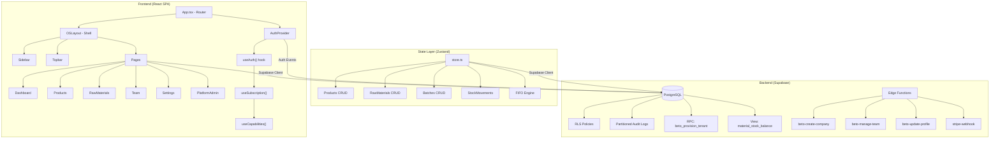
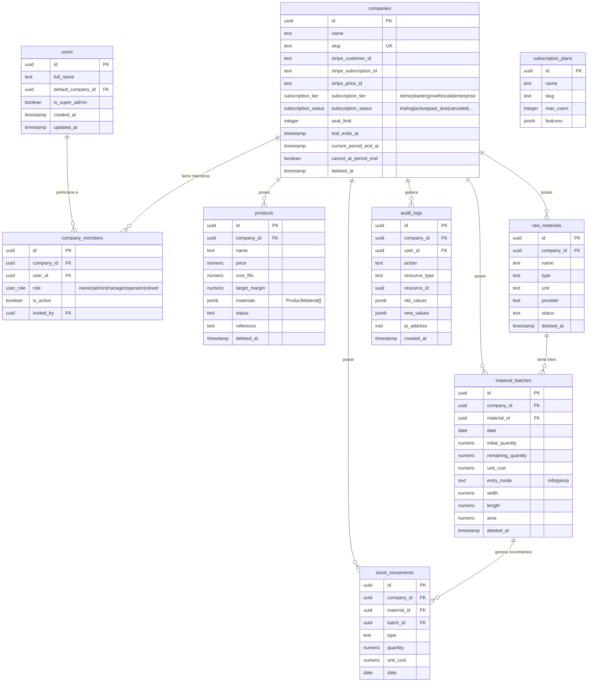
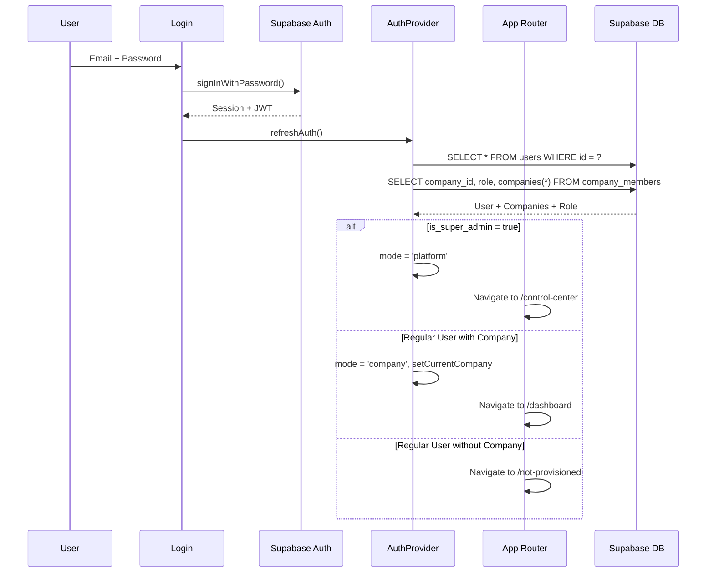
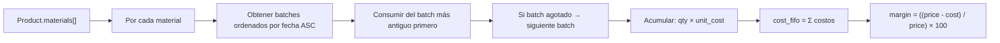
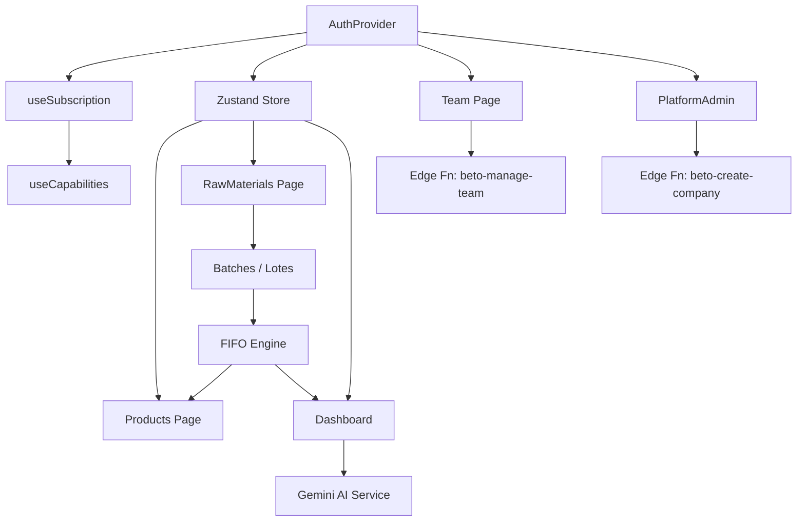
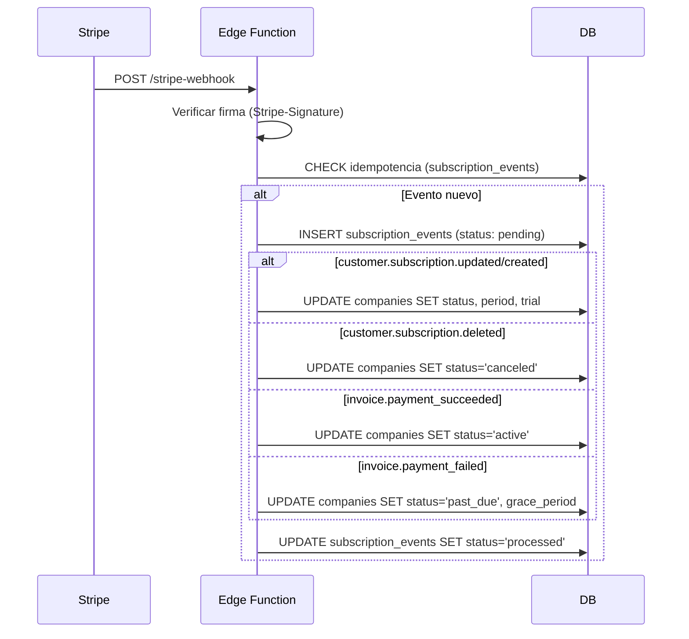
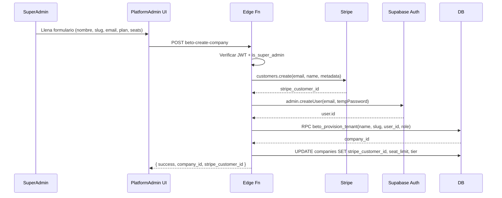
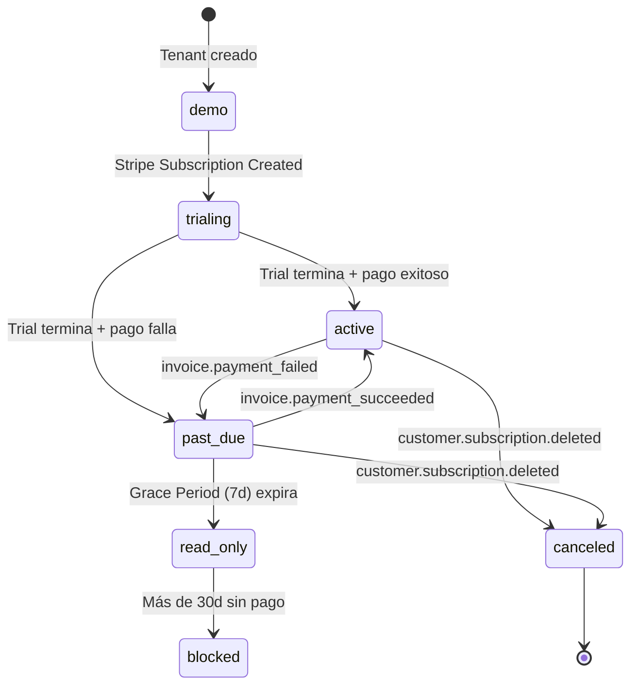
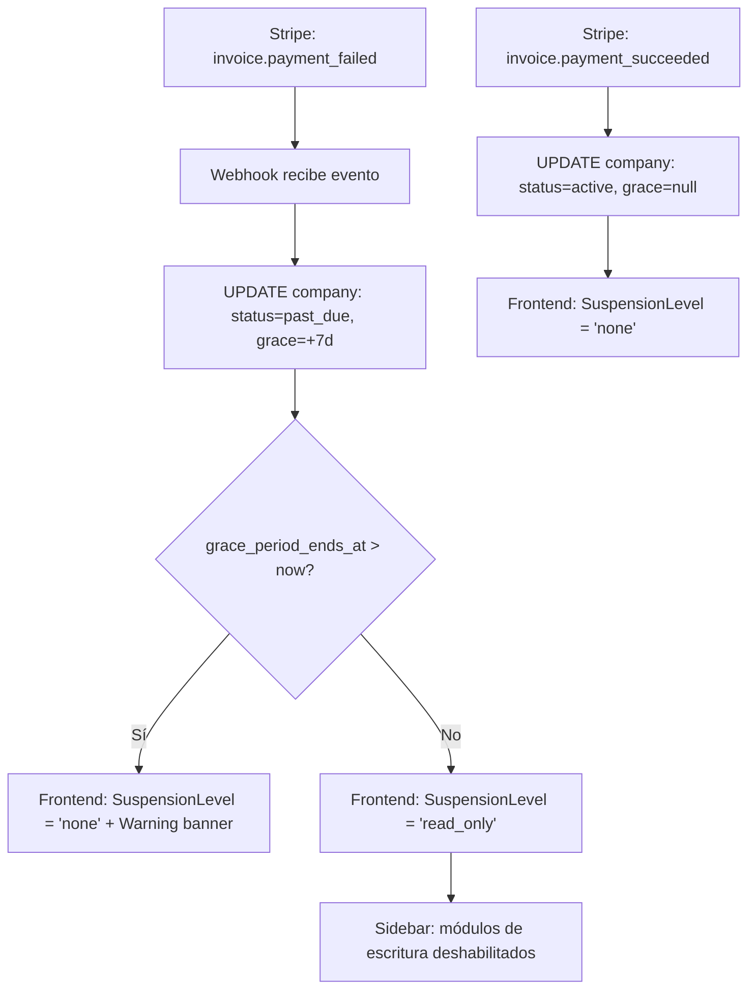

# BETO OS — Cost Margin Manager: Documentación Técnica Completa

> **Versión**: v11.0.0 · **Fecha**: 2026-02-22 · **Stack**: React 19 + Vite 6 + Supabase + Zustand + TailwindCSS 3

---

# Índice

1. [Arquitectura del Sistema](#1-arquitectura-del-sistema)
2. [Features Implementadas](#2-features-implementadas)
3. [Integraciones](#3-integraciones)
4. [Flujos Críticos](#4-flujos-críticos)
5. [Deuda Técnica y Pendientes](#5-deuda-técnica-y-pendientes)
6. [Instrucciones de Setup](#6-instrucciones-de-setup)

---

# 1. Arquitectura del Sistema

## 1.1 Stack Tecnológico

| Capa | Tecnología | Versión |
|------|-----------|---------|
| Frontend | React + TypeScript | 19.2 + 5.8 |
| Build | Vite | 6.2 |
| State Management | Zustand (persist) | 5.0 |
| Routing | React Router DOM | 7.13 |
| Styling | TailwindCSS + Design Tokens | 3.4 |
| Auth + DB + Functions | Supabase | 2.94 |
| Payments | Stripe (via Edge Functions) | 14.x |
| AI | Google Gemini 1.5 Flash | @google/generative-ai 0.24 |

## 1.2 Diagrama de Flujo de Datos



## 1.3 Modelo de Datos — Tablas Principales



**Vista materializada**: `material_stock_balance` — agrega `current_stock` y `last_movement_at` por material y empresa.

**Funciones RPC**:
- `current_company_id()` → Extrae `company_id` del JWT claim para RLS
- `get_company_seat_count(v_company_id)` → Cuenta miembros activos
- `is_super_admin()` → Verifica flag de super admin en JWT

**Enums de base de datos**:
- `subscription_status`: `trialing | active | past_due | unpaid | canceled | incomplete | incomplete_expired`
- `subscription_tier`: `demo | starter | growth | scale | enterprise`
- `user_role`: `owner | admin | manager | operator | viewer`

**Particionamiento**: `audit_logs` está particionado por mes (`audit_logs_p2026_01`, `audit_logs_p2026_02`, etc.)

## 1.4 Flujo de Autenticación y Multi-Tenancy



**Capa de aislamiento multi-tenant**:
1. **RLS (Row Level Security)**: Cada tabla filtra por `company_id` usando `current_company_id()` extraído del JWT.
2. **Frontend Guard**: `App.tsx` verifica `user` + `currentCompanyId` antes de renderizar rutas protegidas.
3. **Edge Functions**: Todas verifican el JWT del header `Authorization` y comprueban membresía/permisos.
4. **Impersonation**: El Super Admin puede entrar en modo `company` via `enterCompanyAsFounder()` sin alterar su sesión real. Headers de trazabilidad (`x-platform-actor-id`, `x-impersonation-active`) se inyectan automáticamente.

## 1.5 Motor de Costos FIFO

El cálculo FIFO está implementado en `src/store.ts`:



**Funciones clave en `store.ts`**:

| Función | Descripción |
|---------|-------------|
| `getConversionFactor(buyUnit, useUnit)` | Convierte entre unidades (`metro↔cm`, `kg↔gramo`) |
| `getFifoBreakdown(material_id, qty, unit, batches, materials)` | Retorna array de consumos parciales por batch |
| `calculateFifoCost(material_id, qty, unit, batches, materials)` | Suma total del costo usando FIFO |
| `calculateProductCost(product, batches, materials)` | Itera `product.materials[]` y suma costos FIFO |
| `calculateMargin(price, cost)` | `((price - cost) / price) * 100` |
| `consumeStock(productId)` | Ejecuta el consumo real, decrementa `remaining_quantity` en batches |

**Unidades soportadas**: `metro | cm | kg | gramo | unidad | bobina | litro`

---

# 2. Features Implementadas

## 2.1 Por Módulo

### Dashboard (`/dashboard`)
| Feature | Estado | Archivo |
|---------|--------|---------|
| KPIs: Productos, Margen Promedio, Stock, Bajo Margen | ✅ Completo | `Dashboard.tsx` |
| Métricas de inventario (costo promedio, lotes activos, rentables) | ✅ Completo | `Dashboard.tsx` |
| Inteligencia de Precios con Gemini AI | ✅ Completo | `geminiService.ts` |
| Refresh manual de análisis AI | ✅ Completo | `Dashboard.tsx` |

### Productos (`/productos`)
| Feature | Estado | Archivo |
|---------|--------|---------|
| CRUD completo de productos | ✅ Completo | `Products.tsx` |
| Composición de materiales (BOM) | ✅ Completo | `Products.tsx` |
| Cálculo de costo FIFO en tiempo real | ✅ Completo | `store.ts` |
| Cálculo de margen | ✅ Completo | `store.ts` |
| Consumo de stock desde producto | ✅ Completo | `store.ts` |
| Sync bidireccional con Supabase | ✅ Completo | `products.service.ts` |

### Materias Primas (`/materias-primas`)
| Feature | Estado | Archivo |
|---------|--------|---------|
| CRUD de materias primas | ✅ Completo | `RawMaterials.tsx` |
| Gestión de lotes (batches) | ✅ Completo | `RawMaterials.tsx` |
| Historial de movimientos de stock | ✅ Completo | `store.ts` |
| Soft delete (`deleted_at`) | ✅ Completo | `inventory.service.ts` |
| Modos de entrada: rollo/pieza | ✅ Completo | `store.ts` |
| Sync con Supabase | ✅ Completo | `inventory.service.ts` |

### Equipo (`/equipo`)
| Feature | Estado | Archivo |
|---------|--------|---------|
| Listar miembros del equipo | ✅ Completo | `Team.tsx` |
| Crear usuario (via Edge Function) | ✅ Completo | `beto-manage-team` |
| Editar usuario (rol, nombre, password) | ✅ Completo | `beto-manage-team` |
| Eliminar usuario | ✅ Completo | `beto-manage-team` |
| Archivar usuarios (bulk) | ✅ Completo | `beto-manage-team` |
| Límite de seats por plan | ⚠️ Hardcoded a 3 | `beto-manage-team:76` |

### Settings (`/settings`)
| Feature | Estado | Archivo |
|---------|--------|---------|
| Página de configuración básica | ⚠️ Esqueleto | `Settings.tsx` |

### Platform Admin (`/control-center`)
| Feature | Estado | Archivo |
|---------|--------|---------|
| Vista de administración de plataforma | ✅ Completo | `PlatformAdmin.tsx` |
| Crear nueva empresa (tenant) | ✅ Completo | `beto-create-company` |
| Editar empresa | ✅ Completo | `EditTenantModal.tsx` |
| Impersonar empresa (Visitor Admin) | ✅ Completo | `AuthProvider.tsx` |
| Environments overview | ✅ Completo | `EnvironmentsPage.tsx` |
| Banner de impersonación | ✅ Completo | `ImpersonationBanner.tsx` |
| Banner de suscripción | ✅ Completo | `SubscriptionBanner.tsx` |

### Autenticación
| Feature | Estado | Archivo |
|---------|--------|---------|
| Login con email/password | ✅ Completo | `Login.tsx` |
| Logout con guardia anti-loop | ⚠️ Bug conocido | `AuthProvider.tsx` / `Topbar.tsx` |
| Sesión persistente (Supabase Auth) | ✅ Completo | `AuthProvider.tsx` |
| Auto-redirect autenticado→dashboard | ✅ Completo | `App.tsx:70-76` |
| Auto-redirect no-autenticado→login | ✅ Completo | `App.tsx:79-81` |
| Detección de usuario no-provisionado | ✅ Completo | `App.tsx:84-91` |

## 2.2 Sistema de Permisos

**Flujo de resolución**:
```
Plan (subscription_tier) → allowedCapabilities[] → useCapabilities().can('edit_costs')
```

**Capabilities definidas** (12 total):

| Capability | Descripción |
|-----------|-------------|
| `view_costs` | Ver costos y dashboard |
| `edit_costs` | Editar costos |
| `delete_costs` | Eliminar costos |
| `view_products` | Ver productos |
| `edit_products` | Crear/editar productos |
| `delete_products` | Eliminar productos |
| `view_raw_materials` | Ver materias primas |
| `edit_raw_materials` | Crear/editar materias primas |
| `view_team` | Ver equipo |
| `manage_team` | Gestionar miembros |
| `configure_system` | Configuración del sistema |
| `manage_tenants` | Gestionar empresas (Super Admin) |

## 2.3 Planes de suscripción

| Plan | Seats | Módulos | Capabilities |
|------|-------|---------|-------------|
| **Demo** | 1 | `cost-manager` | `view_costs` |
| **Starter** | 3 | `cost-manager`, `products`, `inventory`, `team`, `settings` | 9 capabilities específicas |
| **Growth** | 10 | Todos (`*`) | Todas (`*`) |
| **Scale** | 25 | Todos (`*`) | Todas (`*`) |
| **Enterprise** | 999 | Todos (`*`) | Todas (`*`) |

## 2.4 Dependencias entre Módulos



---

# 3. Integraciones

## 3.1 Stripe

**Estado**: ⚠️ Configurado estructuralmente pero con Price IDs placeholder.

**Archivos involucrados**:
- [stripe-webhook/index.ts](file:///c:/Users/Beto/Documents/APP/cost-margin-manager/supabase/functions/stripe-webhook/index.ts) — Webhook handler
- [subscription.config.ts](file:///c:/Users/Beto/Documents/APP/cost-margin-manager/src/platform/subscription.config.ts) — Plan ↔ Price mapping

**Flujo del webhook**:


**Eventos manejados**:
| Evento Stripe | Acción |
|--------------|--------|
| `customer.subscription.created` | Actualiza status + period + trial en `companies` |
| `customer.subscription.updated` | Igual que created |
| `customer.subscription.deleted` | Status → `canceled` |
| `invoice.payment_succeeded` | Status → `active`, limpia grace period |
| `invoice.payment_failed` | Status → `past_due`, grace period = 7 días |

**Variables de entorno Stripe requeridas**:
```
STRIPE_SECRET_KEY
STRIPE_WEBHOOK_SECRET
```

**Placeholder Price IDs** (en [subscription.config.ts:6-11](file:///c:/Users/Beto/Documents/APP/cost-margin-manager/src/platform/subscription.config.ts#L6-L11)):
```typescript
const STRIPE_PRICES = {
    DEMO: 'price_demo_id_placeholder',      // ⚠️ Reemplazar
    STARTER: 'price_starter_id_placeholder', // ⚠️ Reemplazar
    GROWTH: 'price_growth_id_placeholder',   // ⚠️ Reemplazar
    SCALE: 'price_scale_id_placeholder',     // ⚠️ Reemplazar
    ENTERPRISE: 'price_enterprise_id_placeholder' // ⚠️ Reemplazar
};
```

## 3.2 Supabase

### Auth
- **Método**: Email/Password via `signInWithPassword()`
- **Sesión**: JWT almacenado automáticamente por Supabase SDK (localStorage)
- **Listener**: `onAuthStateChange` en `AuthProvider.tsx`
- **Events manejados**: `SIGNED_IN`, `SIGNED_OUT`, `INITIAL_SESSION`

### Row Level Security (RLS)
- Todas las tablas de negocio filtran por `company_id = current_company_id()`
- `current_company_id()` extrae el claim del JWT
- Super Admin bypass via `is_super_admin()` RPC

### Edge Functions (5 funciones)

| Función | Puerto | Auth | Descripción |
|---------|--------|------|-------------|
| `beto-create-company` | Service Role | Super Admin only | Provisiona tenant: crea Stripe Customer → Auth User → RPC `beto_provision_tenant` → actualiza company |
| `beto-manage-team` | Service Role | Admin/Owner | CRUD usuarios: `create`, `update`, `delete`, `bulk_archive`, `bulk_delete` |
| `beto-update-profile` | Service Role | Self | Actualiza `full_name` y/o `password` del usuario autenticado |
| `stripe-webhook` | Service Role | Stripe Signature | Procesa eventos de suscripción (ver 3.1) |
| `stripe-webhook-handler` | — | — | Duplicado/legacy (verificar si está en uso) |

### Impersonation Headers
Cuando `store.isImpersonating === true`, el cliente Supabase inyecta automáticamente:
```javascript
'x-platform-actor-id': '<super_admin_user_id>'
'x-impersonation-active': 'true'
'x-impersonated-company-id': '<target_company_id>'
```
Esto se configura en [supabase.ts:20-38](file:///c:/Users/Beto/Documents/APP/cost-margin-manager/src/services/supabase.ts#L20-L38).

### Migración de Base de Datos
- **Archivo único**: `supabase/migrations/20260220141745_remote_schema.sql` (~100KB)
- Contiene: creación de tablas, enums, RLS policies, funciones RPC, triggers, particiones de audit_logs

## 3.3 Google Gemini AI

- **Modelo**: `gemini-1.5-flash` (free tier)
- **Uso**: Análisis de rentabilidad de productos en Dashboard
- **Archivo**: [geminiService.ts](file:///c:/Users/Beto/Documents/APP/cost-margin-manager/src/services/geminiService.ts)
- **Variable**: `VITE_GEMINI_API_KEY`

## 3.4 Deploy

- **Build**: `vite build` (producción)
- **Dev**: `vite` (HMR)
- **Host sugerido**: Vercel (SPA estático)
- **DB**: Supabase Cloud
- **Edge Functions**: Supabase Edge Functions (Deno)

---

# 4. Flujos Críticos

## 4.1 Onboarding de Nueva Empresa



**Notas**:
- El password temporal se genera como: `Math.random().toString(36).slice(-12) + 'A1!'`
- Si el email ya existe en Auth, la función lanza error
- Si Stripe falla, el tenant se crea sin `stripe_customer_id` (degradación graceful)

## 4.2 Proceso de Suscripción y Pago



**Niveles de suspensión** (implementado en [subscription.ts](file:///c:/Users/Beto/Documents/APP/cost-margin-manager/src/utils/subscription.ts)):

| Estado | Grace Period | Nivel | Efecto |
|--------|-------------|-------|--------|
| `active` / `trialing` | — | `none` | Acceso completo |
| `past_due` | Vigente | `none` | Acceso con warning |
| `past_due` | Expirado | `read_only` | Solo lectura |
| `canceled` / `unpaid` | — | `blocked` | Sin acceso |

## 4.3 Cálculo de Costo de Producto

```
PARA cada material en product.materials[]:
  1. Obtener batches del material, ordenados por fecha ASC
  2. Convertir unidades (ej: gramos → kg) via getConversionFactor()
  3. MIENTRAS requiredQty > 0 Y hay batches:
     a. Tomar el batch más antiguo
     b. consumed = min(batch.remaining_quantity, requiredQty)
     c. cost += consumed × batch.unit_cost
     d. requiredQty -= consumed
     e. Avanzar al siguiente batch
  4. Acumular cost total

COSTO_TOTAL = Σ costos de todos los materiales
MARGEN = ((price - costo) / price) × 100
```

## 4.4 Control de Inventario FIFO

**Entrada de stock**: Un batch se crea con `initial_quantity` = `remaining_quantity` y un `unit_cost`.

**Consumo de stock** (`consumeStock(productId)`):
1. Lee `product.materials[]`
2. Para cada material, consume FIFO de los batches más antiguos
3. Registra `stock_movement` por cada consumo parcial
4. Actualiza `remaining_quantity` de cada batch afectado
5. Persiste todo en Supabase

**Modos de entrada de batch**:
- `rollo`: Se registra con width, length, area. El `unit_cost` se calcula por unidad lineal.
- `pieza`: Entrada estándar por cantidad unitaria.

## 4.5 Suspensión por Impago



---

# 5. Deuda Técnica y Pendientes

## 5.1 Bugs Conocidos

| # | Severidad | Descripción | Archivo | Detalle |
|---|-----------|-------------|---------|---------|
| 1 | 🔴 Crítico | Logout loop: `resetState()` borra guard prematuramente | `AuthProvider.tsx:66-69` | Ver [AUDIT_AUTH_LIFECYCLE.md](file:///c:/Users/Beto/Documents/APP/cost-margin-manager/docs/AUDIT_AUTH_LIFECYCLE.md) |
| 2 | 🟡 Medio | useEffect guardián muerto (solo loguea, no actúa) | `AuthProvider.tsx:238-242` | Código muerto |
| 3 | 🟡 Medio | Seat limit hardcoded a 3 en Edge Function | `beto-manage-team:76` | Debería consultar `companies.seat_limit` |
| 4 | 🟢 Bajo | Doble ruta `/control-center` en App.tsx | `App.tsx:101,107` | Redundancia que podría causar confusión |

## 5.2 Features Planificadas No Implementadas

| Feature | Prioridad | Estado | Notas |
|---------|-----------|--------|-------|
| Stripe Price IDs reales | 🔴 Crítico | Placeholder | `subscription.config.ts` |
| Checkout / Portal de suscripción | 🔴 Crítico | No implementado | Solo webhooks |
| Notificaciones por email de pago fallido | 🟠 Alto | Comentado en `stripe-webhook:177` | |
| Página `/platform/billing` | 🟠 Alto | `PlaceholderPage` | |
| Página `/ai` (AI Consultants) | 🟡 Medio | `PlaceholderPage` | |
| Página `/analytics` | 🟡 Medio | `PlaceholderPage` | |
| Settings completo | 🟡 Medio | Esqueleto básico | |
| Registro público (sign-up) | 🟡 Medio | No existe | Solo "Contacta a tu admin" |
| Password reset flow | 🟡 Medio | No implementado | |
| Audit log viewer en UI | 🟢 Bajo | Datos existen en DB, sin UI | |
| Dark mode | 🟢 Bajo | No implementado | Tokens listos para extensión |

## 5.3 Mejoras Recomendadas

| Área | Recomendación | Impacto |
|------|--------------|---------|
| **Auth** | Aplicar Fix #1-#3 del audit de logout | Elimina bug crítico |
| **Stripe** | Implementar Stripe Checkout Session + Customer Portal | Habilita cobros reales |
| **Security** | CORS en Edge Functions: cambiar `*` por dominio específico | Seguridad |
| **Seats** | Leer `seat_limit` de DB en `beto-manage-team` en lugar de hardcode | Correctitud |
| **Performance** | Memoizar `calculateProductCost()` con useMemo | UX |
| **Types** | Eliminar `as any` en Edge Functions y store mappers | Type Safety |
| **Testing** | Añadir tests unitarios para FIFO engine | Confiabilidad |
| **Edge Function** | Verificar si `stripe-webhook-handler` es duplicado y eliminarlo | Cleanup |
| **Monitoring** | Añadir Sentry o similar para errores en producción | Observability |

---

# 6. Instrucciones de Setup

## 6.1 Variables de Entorno

Crear archivo `.env` en la raíz del proyecto:

```env
# Supabase
VITE_SUPABASE_URL=https://your-project.supabase.co
VITE_SUPABASE_ANON_KEY=eyJ...your-anon-key

# Opcional: URL diferente para funciones locales
VITE_SUPABASE_FUNCTIONS_URL=http://localhost:54321/functions/v1

# Stripe (solo para Edge Functions)
STRIPE_SECRET_KEY=sk_test_...
STRIPE_WEBHOOK_SECRET=whsec_...

# Google Gemini AI
VITE_GEMINI_API_KEY=AIza...

# Supabase CLI (para Edge Functions)
SUPABASE_URL=http://localhost:54321
SUPABASE_SERVICE_ROLE_KEY=eyJ...your-service-role-key
```

## 6.2 Instalación Local

```bash
# 1. Clonar e instalar
git clone <repo-url>
cd cost-margin-manager
npm install

# 2. Iniciar Supabase local (requiere Docker)
npx supabase start

# 3. Aplicar migración
npx supabase db reset
# Esto ejecuta: supabase/migrations/20260220141745_remote_schema.sql

# 4. Iniciar dev server
npm run dev
# → http://localhost:5173
```

## 6.3 Supabase Edge Functions (desarrollo local)

```bash
# Servir todas las funciones
npx supabase functions serve

# Servir una función específica
npx supabase functions serve beto-create-company --env-file .env
```

## 6.4 Configuración de Stripe

1. Crear cuenta en [Stripe Dashboard](https://dashboard.stripe.com)
2. Crear Products con los 5 planes (Demo, Starter, Growth, Scale, Enterprise)
3. Copiar los Price IDs y reemplazar en `src/platform/subscription.config.ts`
4. Configurar webhook endpoint: `https://<supabase-url>/functions/v1/stripe-webhook`
5. Seleccionar eventos: `customer.subscription.*`, `invoice.payment_succeeded`, `invoice.payment_failed`
6. Copiar Signing Secret → `STRIPE_WEBHOOK_SECRET`

## 6.5 Deploy a Producción

```bash
# Build de producción
npm run build
# Output: dist/

# Deploy a Vercel
npx vercel --prod

# Deploy Edge Functions a Supabase
npx supabase functions deploy beto-create-company
npx supabase functions deploy beto-manage-team
npx supabase functions deploy beto-update-profile
npx supabase functions deploy stripe-webhook
```

## 6.6 Estructura de Archivos

```
cost-margin-manager/
├── docs/                           # Documentación técnica
├── src/
│   ├── App.tsx                     # Router principal + guards
│   ├── store.ts                    # Zustand: estado + FIFO engine
│   ├── types.ts                    # Type aliases del dominio
│   ├── database.types.ts           # Auto-generado por Supabase CLI
│   ├── components/
│   │   ├── os/                     # Shell OS (Sidebar, Topbar)
│   │   ├── ui/                     # Componentes reutilizables (10)
│   │   └── entity/                 # Modales de entidad (6)
│   ├── design/
│   │   └── design-tokens.ts        # Sistema de diseño centralizado
│   ├── hooks/
│   │   ├── AuthProvider.tsx        # Context de autenticación
│   │   └── useAuth.ts             # Hook público de auth
│   ├── layouts/
│   │   └── OSLayout.tsx           # Layout con Sidebar + Topbar
│   ├── pages/                     # 9 páginas + 1 subdirectorio
│   ├── platform/                  # 7 archivos de configuración SaaS
│   ├── services/                  # 4 servicios (supabase, gemini, products, inventory)
│   └── utils/
│       └── subscription.ts        # Lógica de suspensión
└── supabase/
    ├── functions/                 # 5 Edge Functions (Deno)
    └── migrations/                # 1 migración baseline
```
